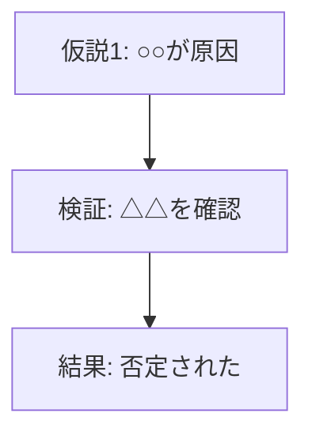
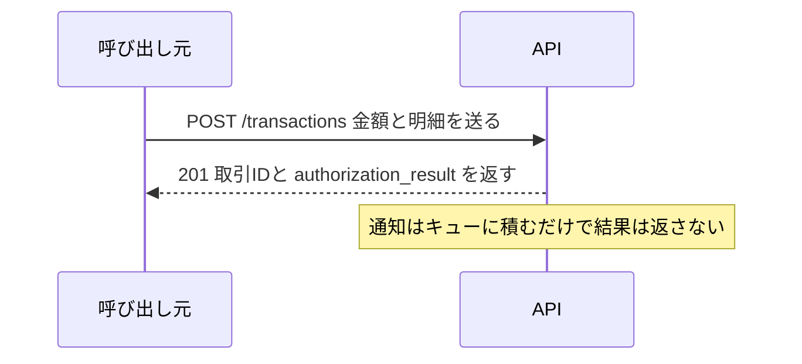

# mermaid の作図ルール

過去に何度も文字被り・構文エラーを起こしている。図を書いたら以下を必ず見直す。

1. 矢印は subgraph(箱)そのものではなく、**箱の中の具体的なノード**に向ける(`A --> subgraphID` ではなく `A --> nodeInsideSubgraph`)
2. 複数の subgraph を横に並べて矢印を交差させる図は `flowchart TB` ではなく `flowchart LR` にする
3. ドット線にラベルを付けるときは前後にスペースを入れる(`-. text .->`。`-.text.-` は構文が壊れることがある)
4. **【flowchart のみ】同じ2つのノードを逆向きの矢印2本(A→B と B→A)で結ばない。** mermaid が重ねて描画しラベルが重なる。「行き」の1本だけ描き、「戻り」は図の下に文章で書く。**sequence diagram はこの制約を受けない**(時系列で縦に並ぶので重ならない)。ルール8を参照
5. **subgraph のタイトルに ` ` で改行を入れない**(1行の短いタイトルにする)。特に中に円柱型(DB)ノードがあると、タイトルが2行になった瞬間に中のノードとぶつかる。長い説明はノード側のラベルに書く
6. ノードのテキストが長い、またはノード数が4つ以上ある一直線のチェーン図は `flowchart LR` ではなく `flowchart TB` にする。LR で長文ノードを横に並べると図全体が横に伸びすぎて文字が読めなくなる。LR を使うのはルール2の「subgraph を横に並べて矢印が交差する」ケースに限定する
7. **ノード内で ` ` / ` ` による改行を使わない。** HTML タグを解釈しない Markdown ビューア(backlog の Web UI で実際に確認済み)では、そのまま文字列として表示されてしまう。1ノードのテキストは1行の短い文言に収め、長い説明は複数のノードに分割してチェーンで繋ぐ
8. **sequence diagram では、リクエストだけでなくレスポンス(返り値)も必ず描く**(2026-09-01ルール化)。実線 `->>` がリクエスト、破線 `-->>` がレスポンス。**しかもレスポンスのラベルには「何が返るか」を具体的に書く**(`200 OK` ではなく `authorization_result 1=OK / 2=NG と取引ID`)。理由は、システム間連携の図で本当に読み手が知りたいのは「呼んだ結果として何が手に入るのか」だからで、片道の矢印だけの図は処理の順番しか伝えない。「返り値が無い」ことに意味がある場合(fire-and-forget の非同期投入など)は、レスポンスを省くのではなく `Note over` でその旨を書く

補足の詳細は図の中に押し込まず、図の下に文章で書く。

## 委任先に作図させるとき

サブエージェントに図を含む成果物を書かせる場合、この skill を `~/.claude/agents/*.md` の `skills:` フィールドに入れてプリロードする(発火判断が不要になる)。herdr のワーカーペインに委任する場合は skill がロードされる保証がないので、**ルール7だけはプロンプト本文に再掲する**(2026-08-21、委任先が生成した backlog doc に ` ` が入る事故があった)。

## チャットに図を書かない

ユーザーのチャット環境では mermaid がレンダリングされない(2026-07-30 確認)。図が要る説明は `backlog doc` などの md ファイルにまとめて、そちらを見てもらう。
