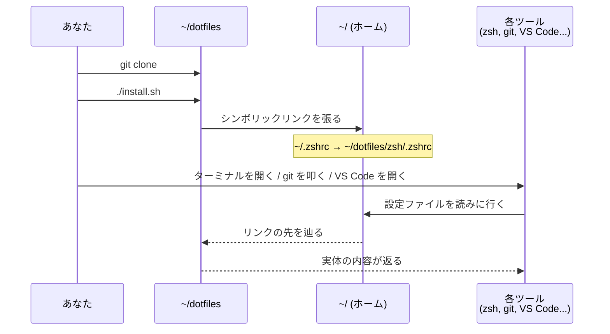
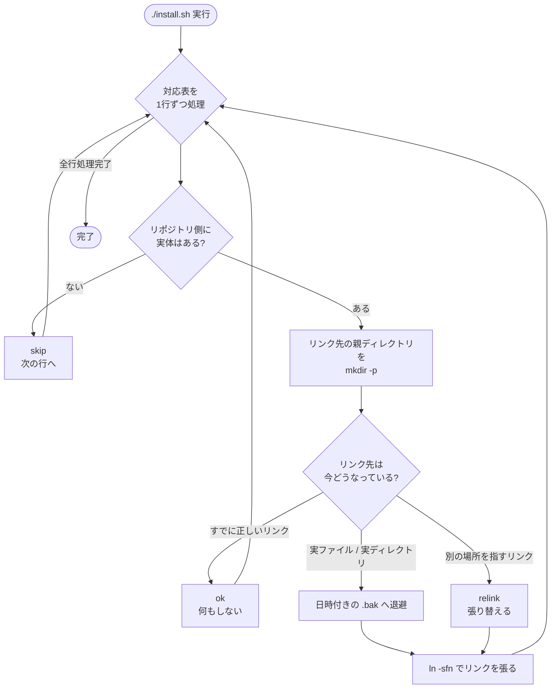
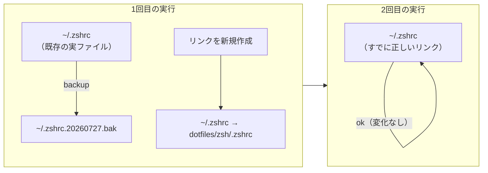
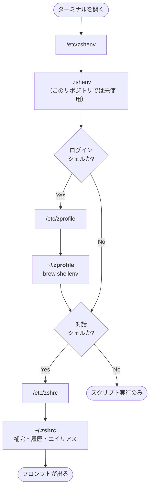
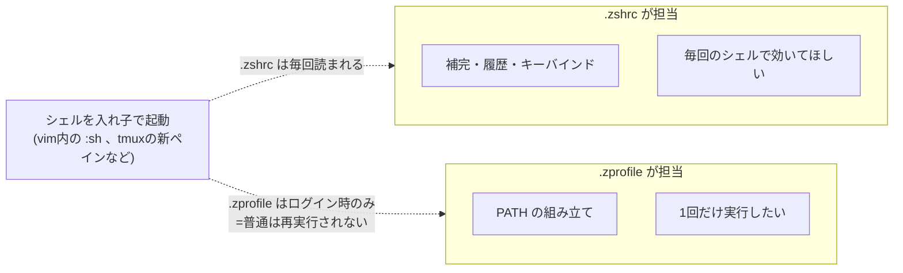
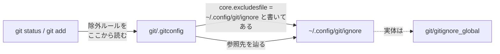
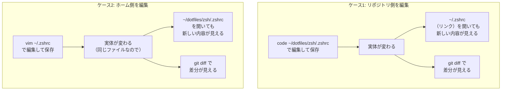
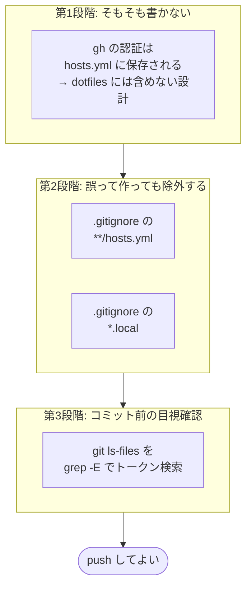
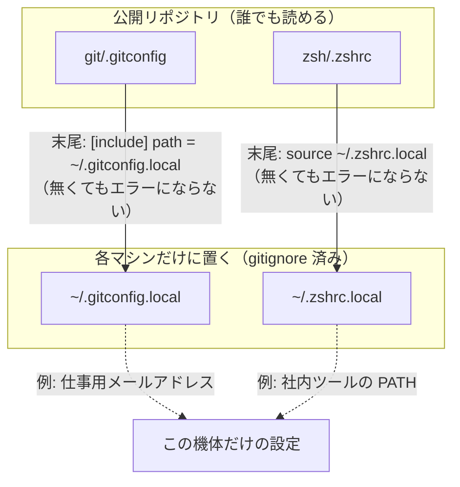
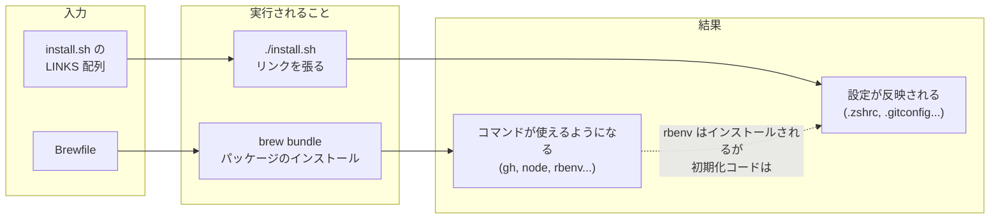

# 仕組み

「なぜこう動くのか」を図で追う。

- どこに何があるかは [structure.md](structure.md)
- 個々の設定の意味は [settings.md](settings.md)

---

## 全体の流れ

新しいマシンで `./install.sh` を叩いてから、実際に設定が効くまでの流れ。

**ツール側は「リンクを辿っている」ことを知らない。**
`~/.zshrc` を普通のファイルとして開いているつもりで、実体は `~/dotfiles` にある。

---

## install.sh の動き

**同じコマンドを2回叩いても結果が変わらない**（冪等性）。
2回目はすべて `ok` の分岐に落ちるため、`.bak` が増えたりリンクが壊れたりしない。

### 1回目と2回目で何が違うか

---

## zsh の読み込み順序

ターミナルを開いたとき、どのファイルがどの順で読まれるか。
このリポジトリが管理するのは太字の2つだけで、他は macOS / Homebrew / Nix が用意する。

**Terminal.app や iTerm2 の新規タブは「ログイン かつ 対話」シェルとして起動する。**
そのため `.zprofile` → `.zshrc` の順に両方読まれる。

### なぜ2ファイルに分けているか

`PATH` の組み立てを `.zshrc` に置くと、シェルを入れ子で起動するたびに実行され、
`typeset -U path` で重複除去していても無駄な処理が積み重なる。
`.zprofile` はログイン時の1回で済むため、ここに置くのが正しい。

---

## git の2ファイルの関係

`git/.gitconfig` と `git/gitignore_global` は**別々のファイルだが独立していない**。

`.gitconfig` の中の1行が、もう片方のファイルへの**参照**になっている。
片方だけ新しいマシンにコピーしても、参照が壊れて gitignore が効かなくなる。

---

## リンクされたファイルを編集したときに何が起きるか

**シンボリックリンクなので、どちらから編集しても同じ実体を書き換える。**

**「どちらを編集しても実体は1つ」**なので、コミットし忘れることはあっても、
編集内容が反映されないという事故は起きない。

---

## 秘密情報を混入させない仕組み

3段階の防御になっている。

どこか1段が抜けても、次の段で止まるようにしている。
実際に運用でも、この後の段階（`*.local` の仕組み）を先に用意したことで
「秘密情報が混ざるからコミットできない」という状態を避けている。

---

## `*.local` による秘密情報の分離

`[include]` も `source` も、**参照先のファイルが存在しなくてもエラーにならない**。
そのため個人のマシンでも会社のマシンでも同じ `install.sh` が動き、
必要な差分だけを `*.local` に手で足せばよい。

---

## Brewfile と install.sh の役割分担

「何を入れるか」と「どこにリンクを張るか」は別の関心事なので、別ファイルに分けている。

**Brewfile が入れたツールを、`.zshrc` が初期化する**という依存関係が一部ある
（`rbenv init` など）。そのためインストールの順序は
「Homebrew → clone → install.sh → brew bundle」で、
`install.sh` を先に実行してリンクを張ってから `brew bundle` する必要はない
（どちらが先でも動くが、README の手順はこの順で書いてある）。

---

## 関連ドキュメント

| ファイル | 内容 |
|---|---|
| [README.md](../README.md) | 新マシンでの復元手順 |
| [structure.md](structure.md) | ディレクトリ構成 |
| [settings.md](settings.md) | 設定を1項目ずつ解説 |
