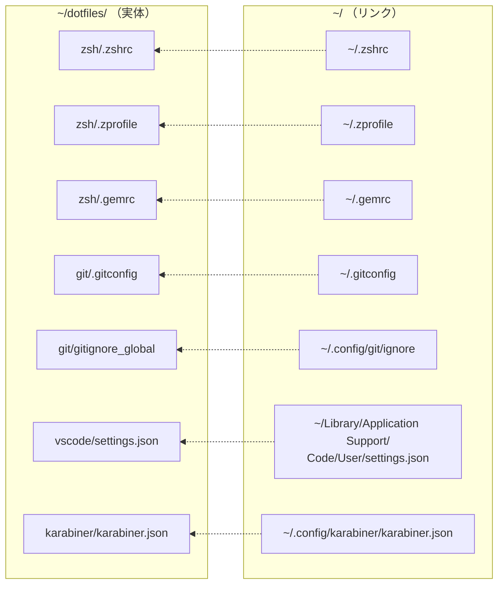
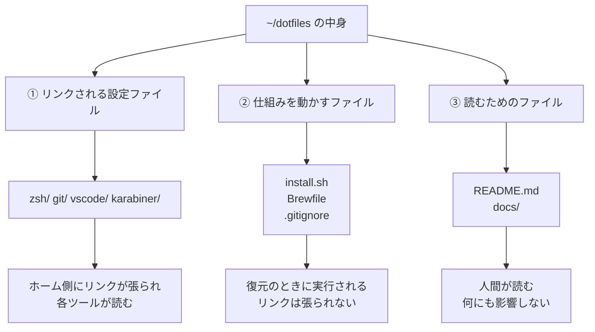
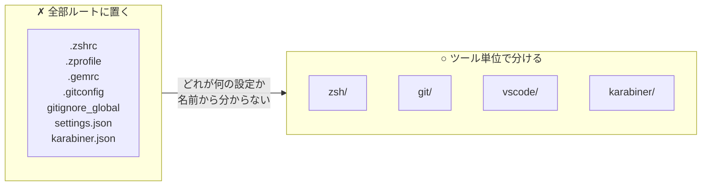
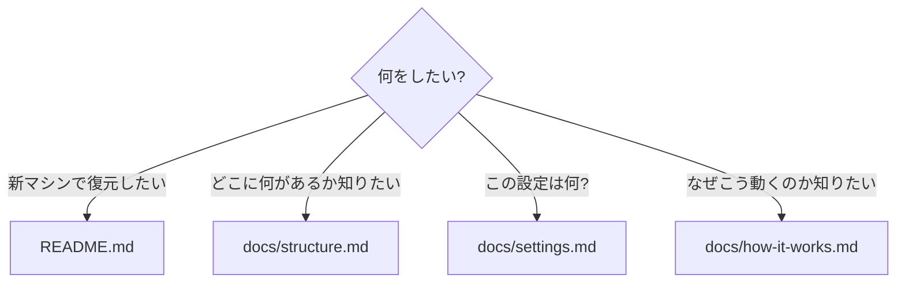
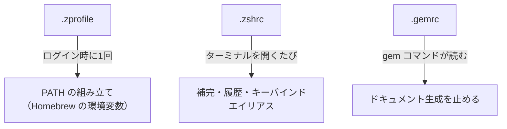
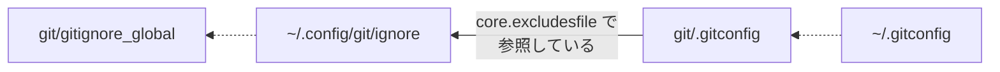
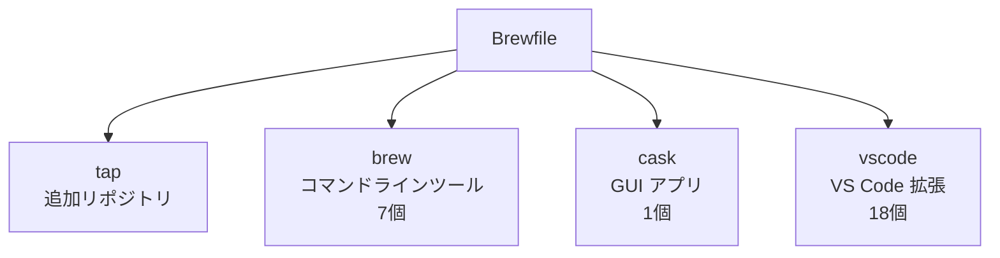
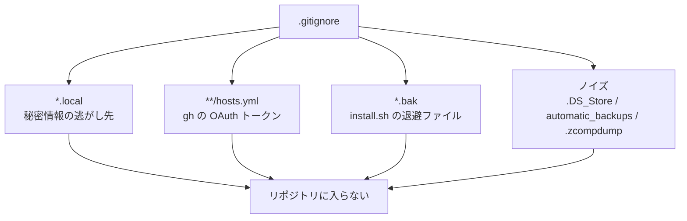
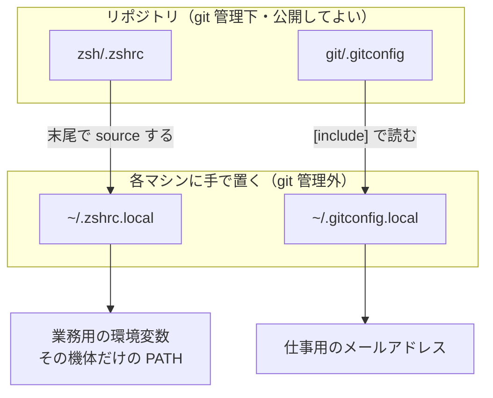

# ディレクトリ構成

このリポジトリに何がどこにあるか、なぜその分け方なのかをまとめる。

個々の設定項目の意味は [settings.md](settings.md)、
仕組み（リンクの張られ方・読み込み順序）は [how-it-works.md](how-it-works.md) を参照。

---

## 全体像

```
~/dotfiles/
│
├── README.md              入口。新マシンでの復元手順
├── install.sh             シンボリックリンクを張る本体
├── Brewfile               Homebrew で入れるものの一覧
├── .gitignore             このリポジトリで追跡しないもの
│
├── docs/                  解説（リンクは張られない）
│   ├── structure.md         ← このファイル
│   ├── settings.md          設定を1項目ずつ解説
│   └── how-it-works.md      仕組みの解説
│
├── zsh/                   シェル
│   ├── .zshrc               対話シェルの設定
│   ├── .zprofile            ログイン時に1回だけ走る設定
│   └── .gemrc               RubyGems の設定
│
├── git/
│   ├── .gitconfig           git 本体の設定
│   └── gitignore_global     全リポジトリに効く gitignore
│
├── vscode/
│   └── settings.json        VS Code のユーザー設定
│
└── karabiner/
    └── karabiner.json       キーボードのカスタマイズ
```

---

## リポジトリとホームの対応

**実体はリポジトリ側にあり、ホーム側はそこを指すシンボリックリンク。**



点線がシンボリックリンク。この対応表は [install.sh](../install.sh) の `LINKS` 配列に
そのまま書かれている。**リンクを増やしたいときはあの配列に1行足すだけ。**

> リポジトリ側のファイルを編集すれば即座に反映される。
> コピーではなくリンクなので、`~/.zshrc` を直接編集してもリポジトリ側が変わる。

---

## ファイルの分類

リポジトリ内のファイルは、役割で3つに分かれる。



| | リンクされる | 実行される | 削除したら |
|---|---|---|---|
| `zsh/` `git/` `vscode/` `karabiner/` | ○ | — | 設定が失われる |
| `install.sh` | — | ○ | 復元できなくなる |
| `Brewfile` | — | ○ | パッケージ一覧が失われる |
| `docs/` `README.md` | — | — | **動作には影響しない** |

---

## なぜこの分け方なのか

### トピックごとにディレクトリを切る

`zsh/` `git/` `vscode/` `karabiner/` のように、**ツール単位**で分けている。



利点:

- **`settings.json` のような一般的すぎる名前が衝突しない**
  （VS Code 以外にも `settings.json` を使うツールがある）
- ツールを使わなくなったらディレクトリごと消せる
- `install.sh` の対応表と1対1に対応するので追いやすい

### ただし細かく分けすぎない

`zsh/config/aliases/git.zsh` のような深い階層にはしていない。

現状 `.zshrc` は115行、`.gitconfig` は118行で、**1ファイルで読み切れる量**に収まっている。
分割は「1ファイルが読み切れなくなってから」で間に合う。

> この方針は [Dries Vints の記事](https://driesvints.com/blog/getting-started-with-dotfiles/)
> が参考元。細かく分けた構成から少数のファイルへ戻した経緯が書かれている。

### `docs/` を分けている理由

README は「新しいマシンで復元する人」が読むもの。
解説を全部そこに書くと、手順が埋もれる。



---

## ディレクトリごとの説明

### `zsh/`

シェルの設定。**3ファイルの役割がはっきり分かれている。**



| ファイル | いつ読まれるか | 何を置くか |
|---|---|---|
| `.zprofile` | ログインシェルの起動時に**1回だけ** | 一度決めれば変わらないもの（`PATH`） |
| `.zshrc` | 対話シェルを開く**たびに毎回** | 対話操作に関わるもの（補完・履歴） |
| `.gemrc` | `gem` コマンドの実行時 | RubyGems のオプション |

`.zprofile` と `.zshrc` の使い分けが重要。`PATH` の組み立てを `.zshrc` に書くと、
シェルを入れ子で起動するたびに実行されて `PATH` が伸びていく。

詳しい読み込み順序は [how-it-works.md](how-it-works.md#zsh-の読み込み順序)。

### `git/`

git の設定。**2ファイルは別の場所にリンクされる。**



`.gitconfig` の中で `core.excludesfile = ~/.config/git/ignore` と書いているため、
**この2つは連動している**。片方だけ移すと gitignore が効かなくなる。

ファイル名が `gitignore_global` なのは、リポジトリ内に `.gitignore` がすでにあり、
そちらと紛らわしくならないようにするため（リンク先では `ignore` という名前になる）。

### `vscode/`

VS Code のユーザー設定。リンク先のパスに**空白が含まれる**のが特徴。

```
~/Library/Application Support/Code/User/settings.json
                    ↑ ここ
```

このため `install.sh` の中の変数展開は必ず `"` で囲っている。囲い忘れると
`Application` と `Support` が別々の引数として扱われて壊れる。

> `snippets/` も管理対象にできるが、現在は空なので入れていない。

### `karabiner/`

キーボードのカスタマイズ設定。

`~/.config/karabiner/` には `automatic_backups/` という自動バックアップの
ディレクトリもあるが、**これは追跡していない**（`.gitignore` で除外）。
設定を変更するたびに増えるためノイズになる。

### `docs/`

解説ファイル。**リンクは張られず、実行もされない。**
消しても環境の動作には影響しない。

---

## ルート直下のファイル

### `install.sh`

対応表を持ってシンボリックリンクを張る。
**このリポジトリで唯一の実行ファイル。**

処理の流れは [how-it-works.md](how-it-works.md#installsh-の動き) を参照。

### `Brewfile`

`brew bundle` が読むパッケージ一覧。3種類が1ファイルに入っている。



`brew bundle dump --vscode --force` で現在の状態から作り直せる。

### `.gitignore`

**主目的はトークンの混入防止。**



---

## リポジトリに入らないファイル

**秘密情報とマシン固有の設定は、リポジトリの外に置く。**



どちらも**存在しなくてもエラーにならない**ので、必要になったマシンにだけ置けばよい。

この構成があるおかげで「秘密情報が混ざるからコミットできない」という状態を避けられる。

---

## 生成されるファイル

実行の結果として生まれ、リポジトリには入らないもの。

| ファイル | 誰が作るか | 場所 |
|---|---|---|
| `<名前>.<日時>.bak` | `install.sh` が既存の実ファイルを退避したもの | ホーム側 |
| `~/.zcompdump` | zsh の補完キャッシュ | ホーム |
| `~/.cache/zsh/zcompcache` | 補完結果のキャッシュ | ホーム |
| `~/.zsh_history` | コマンド履歴 | ホーム |

いずれも消しても再生成される。

---

## 関連ドキュメント

| ファイル | 内容 |
|---|---|
| [README.md](../README.md) | 新マシンでの復元手順 |
| [settings.md](settings.md) | 設定を1項目ずつ解説 |
| [how-it-works.md](how-it-works.md) | リンクの張られ方・読み込み順序・秘密情報の守り方 |
